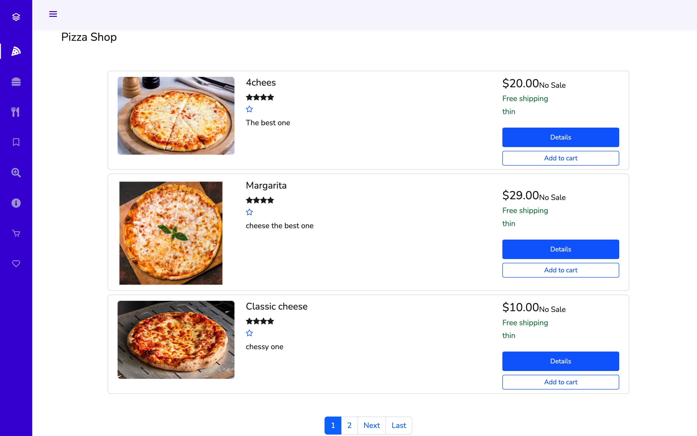
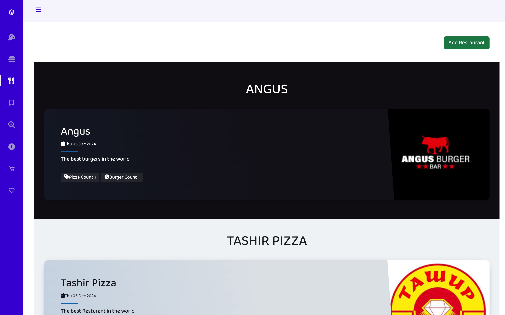
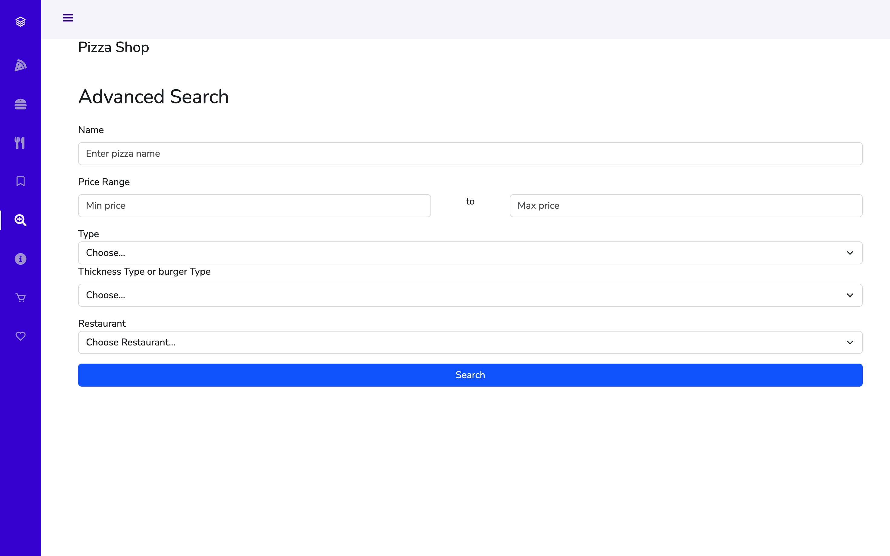
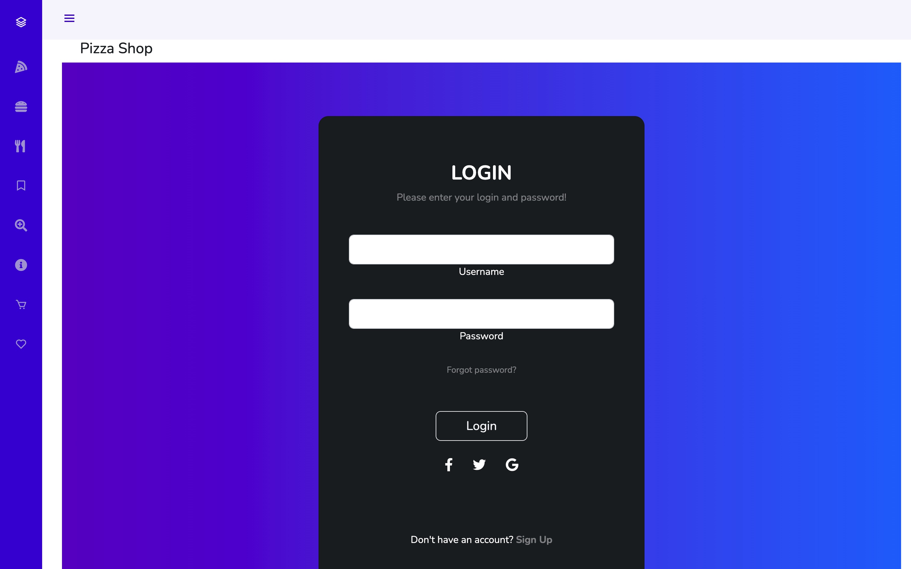
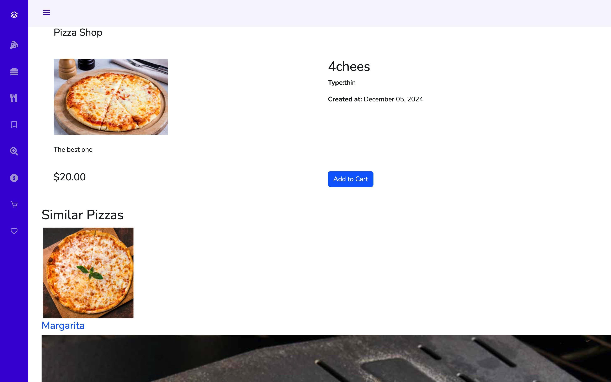

# Pizza Burger Website  

A web project where users can log in, search for pizzas and burgers, and navigate through a the website.  

## Features  
- User authentication system implemented.  
- Search functionality for pizzas and burgers.  
- Structured HTML layout created for the website.  
-  Similar items suggestion.  

## Installation  

1. Clone the repository:  
   ```bash
   git clone https://github.com/your-username/pizza-burger-website.git





